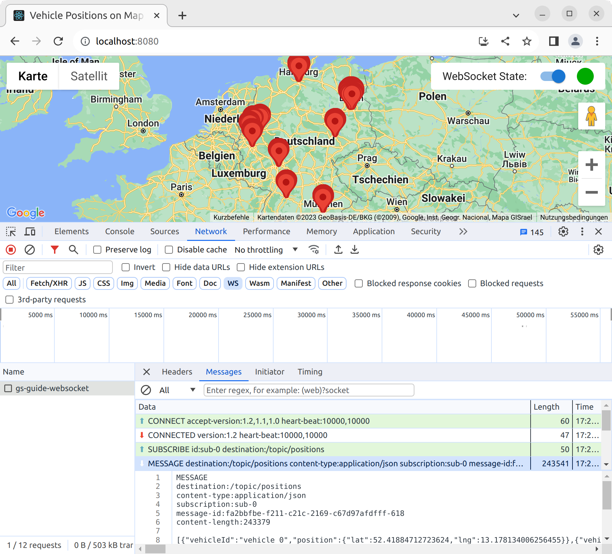

# Map Marker Updates using Websocket

Map based applications that show vehicles or other objects
that frequently change their position typically require these positions to be
as up-to-date as possible.
Technically speaking the state synchronization between server and client needs to be fast.

A simple solution for this problem would be that the client polls the server
on a short interval for position updates.
This however has the drawback that it leads to potentially unnecessary high network traffic.
For mobile clients it might also drain the battery.
Therefore, for low-latency scenarios a server 
[push technology](https://en.wikipedia.org/wiki/Push_technology)
might be a better option.

This repository demonstrates a Websocket based solution.
It consists of the following components:

## STOMP Message Broker
The broker _knows_ the up-to-date vehicle position data and publishes
them on an outgoing Websocket channel using the [STOMP](https://stomp.github.io) protocol.

This project utilizes
[Spring Boot](https://spring.io/projects/spring-boot) and its 
[Spring STOMP message broker](https://docs.spring.io/spring-framework/reference/web/websocket/stomp.html).
The [CrawlPositionTask](src/main/kotlin/org/wahlen/mapwebsocket/task/CrawlPositionsTask.kt)
queries the 
[VehiclePositionService](src/main/kotlin/org/wahlen/mapwebsocket/service/VehiclePositionService.kt)
on a short interval for new positions and sends them out using the
[PositionBroadcastService](src/main/kotlin/org/wahlen/mapwebsocket/service/PositionBroadcastService.kt).
The VehiclePositionService simulates vehicle positions by generating random coordinates.
Note, that the broker gets configured in the
[WebSocketConfig](src/main/kotlin/org/wahlen/mapwebsocket/configuration/WebSocketConfig.kt).

## Browser Client
The browser client subscribes to the Websocket channel,
receives the vehicle position messages and renders map markers accordingly
on a map.

This project provides a [React](https://react.dev/) single page application
in the [frontend](frontend) folder
that was initially created by [Create React App](https://create-react-app.dev/).
Relevant components of the client are the
[@stomp/stompjs](https://github.com/stomp-js/stompjs) package for the
Websocket communication and the
[@googlemaps/react-wrapper](https://github.com/googlemaps/react-wrapper)
to integrate with
[Google Maps](https://developers.google.com/maps).

### Build the service
The frontend requires a 
[Google Maps API key](https://developers.google.com/maps/documentation/javascript/get-api-key).
Execute the command
```
copy frontend/.env.sample frontend/.env
```
Then edit the file `frondend/.env` and configure a proper Google Maps API key. 

The Spring Boot based STOMP broker is built using [gradle](https://gradle.org/).
The [built configuration](build.gradle.kts) uses the
[frontend-gradle-plugin](https://siouan.github.io/frontend-gradle-plugin)
to also build the client application in the [frontend](frontend) folder.

Therefore, client and server can be built with the command
```
./gradlew build
```
In this step a React app, optimized for production is built and stored
in the `static` folder under [src/main/resources](src/main/resources) folder
where it gets automatically served from Spring Boot's embedded servlet container. 

### Run the service
Start the service with the command
```
./gradlew bootRun
```
and use your browser to open the URL
[http://localhost:8080](http://localhost:8080).
You should be able to connect to the WebSocket with the _Connect_ switch button.

The following picture shows the resulting screen and the WebSocket interactions
taken from the Chrome developer console:


### Development
For frontend development it is more convenient to use the command
```
yarn start
```
in the [frontend](frontend) folder and open the client app under the URL
[http://localhost:3000](http://localhost:3000).
The biggest advantage is that the node service allows hot reloading of code changes.
